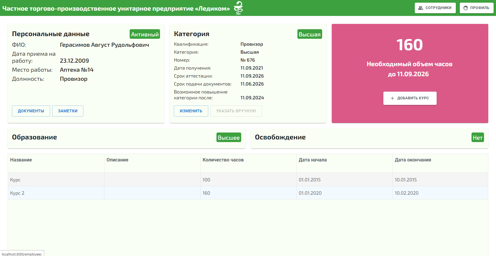

# Course Manager - Spring Boot Project

The task of the application is to manage the procedure and conditions for the professional certification of medical, pharmaceutical and other healthcare staff in accordance with the [Order of the Ministry of Health of Belarus of May 28, 2021](https://drive.google.com/file/d/1vyMJ6nQyD6IABKVfE_XWnjYTZihsr-pD/view?usp=sharing "Order of the Ministry of Health of Belarus of May 28, 2021").

The below documentation describes only the technical side of the application, without touching on the business logic.

 

<a href="https://github.com/hlebshypulahub/Course-Manager-Front"><strong>Front end application »</strong></a>

 

  Built with ❤︎ by <a href="https://www.linkedin.com/in/hlebshypula/">Hleb Shypula</a>

 

|     Service     | Badge | Badge | Badge | Badge | Badge |
|-----------------|-------|-------|-------|-------|-------|
|  **Technologies**     |||||
|  **Code**    |||||

 

## Application screenshots

**More [Screenshots](documents/SCREENSHOTS.md)**

## Details

- [Technology stack & other Open-source libraries](documents/technology_stack.md)   
- [Architecture](documents/architecture.md) 
- [Installation](documents/INSTALLATION.MD)  
- [Deployment](documents/DEPLOYMENT.md)  
- [Security](documents/API.md)  
- [Testing API](documents/TESTING.MD)  
- [Changelog](documents/CHANGELOG.md) 
- [Code Coverage](documents/CODE_COVERAGE.MD) 
- [Documentation](documents/DOCUMENTATION.MD) 

## Contact

Hleb Shypula - glebszypula1997@gmail.com
