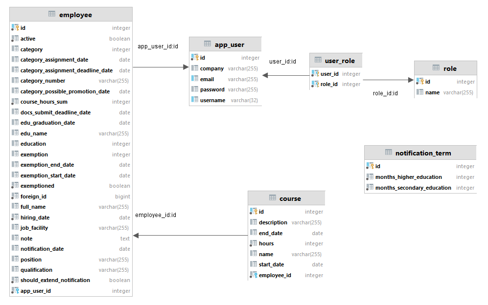

## Architecture

## EER Diagram

*	The authentication and authorization is governed by App User and Role collection.

[](images/erd.png)

## Files and Directories Structure

The project (a.k.a. project directory) has a particular directory structure. A representative project is shown below:

### Project Structure

```text
+---src
|   +---main
|   |   +---java
|   |   |   \---com
|   |   |       \---hs
|   |   |           \---coursemanagerback
|   |   |               |   AppConfig.java
|   |   |               |   CourseManagerBackApplication.java
|   |   |               |   LoggerConfig.java
|   |   |               |   WebSecurityConfig.java
|   |   |               |
|   |   |               +---controller
|   |   |               |   +---authentication
|   |   |               |   |       AuthController.java
|   |   |               |   |
|   |   |               |   +---employee
|   |   |               |   |       CourseController.java
|   |   |               |   |       EmployeeController.java
|   |   |               |   |
|   |   |               |   +---exception
|   |   |               |   |       CustomRestExceptionHandler.java
|   |   |               |   |
|   |   |               |   +---file
|   |   |               |   |       FileController.java
|   |   |               |   |
|   |   |               |   +---myenum
|   |   |               |   |       CategoryController.java
|   |   |               |   |       DocumentTypeController.java
|   |   |               |   |       EducationController.java
|   |   |               |   |       ExemptionController.java
|   |   |               |   |
|   |   |               |   \---principal
|   |   |               |           PrincipalController.java
|   |   |               |
|   |   |               +---documents
|   |   |               |       course_plan.html
|   |   |               |       professional_report.html
|   |   |               |       qualification_sheet.html
|   |   |               |       representation.html
|   |   |               |
|   |   |               +---exception
|   |   |               |       CategoryNotValidException.java
|   |   |               |       EducationNotValidException.java
|   |   |               |       EmptyCoursesListException.java
|   |   |               |       FileStorageException.java
|   |   |               |       
|   |   |               +---html-forms
|   |   |               |       notification.html
|   |   |               |       
|   |   |               +---model
|   |   |               |   +---apierror
|   |   |               |   |       ApiError.java
|   |   |               |   |
|   |   |               |   +---course
|   |   |               |   |       Course.java
|   |   |               |   |
|   |   |               |   +---documents
|   |   |               |   |       DocumentDto.java
|   |   |               |   |       PastJob.java
|   |   |               |   |       ProfessionalReportDto.java
|   |   |               |   |       QualificationSheetDto.java
|   |   |               |   |       RepresentationDto.java
|   |   |               |   |
|   |   |               |   +---employee
|   |   |               |   |   |   Employee.java
|   |   |               |   |   |
|   |   |               |   |   \---dto
|   |   |               |   |           EmployeeActiveDto.java
|   |   |               |   |           EmployeeCategoryDeadlineDto.java
|   |   |               |   |           EmployeeCategoryDto.java
|   |   |               |   |           EmployeeDto.java
|   |   |               |   |           EmployeeEducationDto.java
|   |   |               |   |           EmployeeExemptionDto.java
|   |   |               |   |           EmployeeNoteDto.java
|   |   |               |   |
|   |   |               |   +---enumeration
|   |   |               |   |       Category.java
|   |   |               |   |       DocumentType.java
|   |   |               |   |       Education.java
|   |   |               |   |       Exemption.java
|   |   |               |   |
|   |   |               |   +---notification
|   |   |               |   |       NotificationTerm.java
|   |   |               |   |
|   |   |               |   \---user
|   |   |               |           Role.java
|   |   |               |           User.java
|   |   |               |           UserDetailsImpl.java
|   |   |               |           UserRole.java
|   |   |               |
|   |   |               +---repository
|   |   |               |       CourseRepository.java
|   |   |               |       EmployeeRepository.java
|   |   |               |       NotificationTermRepository.java
|   |   |               |       RoleRepository.java
|   |   |               |       UserRepository.java
|   |   |               |
|   |   |               +---security
|   |   |               |   +---filter
|   |   |               |   |       AuthTokenFilter.java
|   |   |               |   |
|   |   |               |   +---jwt
|   |   |               |   |       JwtUtils.java
|   |   |               |   |
|   |   |               |   +---payload
|   |   |               |   |   +---request
|   |   |               |   |   |       EditRequest.java
|   |   |               |   |   |       LoginRequest.java
|   |   |               |   |   |       SignupRequest.java
|   |   |               |   |   |
|   |   |               |   |   \---response
|   |   |               |   |           JwtResponse.java
|   |   |               |   |           MessageResponse.java
|   |   |               |   |
|   |   |               |   \---util
|   |   |               |           AuthEntryPointJwt.java
|   |   |               |
|   |   |               +---service
|   |   |               |   +---course
|   |   |               |   |       CourseService.java
|   |   |               |   |
|   |   |               |   +---employee
|   |   |               |   |       EmployeeCategoryService.java
|   |   |               |   |       EmployeeDataService.java
|   |   |               |   |       EmployeeDocumentService.java
|   |   |               |   |       EmployeeExemptionService.java
|   |   |               |   |       EmployeeFileService.java
|   |   |               |   |       EmployeeFilteringService.java
|   |   |               |   |       EmployeeNoteService.java
|   |   |               |   |       EmployeePostConstructService.java
|   |   |               |   |       EmployeeValidationService.java
|   |   |               |   |
|   |   |               |   +---file
|   |   |               |   |       FileService.java
|   |   |               |   |
|   |   |               |   \---user
|   |   |               |           PrincipleService.java
|   |   |               |           UserDetailsServiceImpl.java
|   |   |               |
|   |   |               +---utils
|   |   |               |   |   StringDocumentsUtils.java
|   |   |               |   |
|   |   |               |   \---converters
|   |   |               |           LocalDateToStringConverter.java
|   |   |               |
|   |   |               \---validator
|   |   |                       CategoryAssignmentDateNotNull.java
|   |   |                       CategoryAssignmentDateNotNullValidator.java
|   |   |                       CategoryDatesNotNull.java
|   |   |                       CategoryDatesNotNullValidator.java
|   |   |                       CategoryNumberNotBlank.java
|   |   |                       CategoryNumberNotBlankValidator.java
|   |   |                       ExemptionNotNull.java
|   |   |                       ExemptionNotNullValidator.java
|   |   |                       StartDateBeforeEndDate.java
|   |   |                       StartDateBeforeEndDateValidator.java
|   |   |
|   |   \---resources
|   |       |   application-test.properties
|   |       |   application.properties
|   |       |   log4j2.xml
|   |       |
|   |       +---static
|   |       \---templates
|   \---test
|       \---java
|           \---com
|               \---hs
|                   \---coursemanagerback
|                       +---apierror
|                       |       ApiErrorPojoTests.java
|                       |
|                       +---controller
|                       |       CategoryControllerTests.java
|                       |       CourseControllerTests.java
|                       |       EducationControllerTests.java
|                       |       EmployeeControllerTests.java
|                       |       ExemptionControllerTests.java
|                       |       
|                       +---course
|                       |       CoursePojoTests.java
|                       |       CourseRepositoryIntegrationTests.java
|                       |       CourseServiceIntegrationTests.java
|                       |       CourseServiceTests.java
|                       |       CourseValidationTests.java
|                       |       EmptyCoursesListExceptionTests.java
|                       |
|                       +---dto
|                       |       EmployeeActivePatchDtoTests.java
|                       |       EmployeeCategoryDeadlineDtoTests.java
|                       |       EmployeeCategoryDtoTests.java
|                       |       EmployeeEducationDtoTests.java
|                       |       EmployeeExemptionDtoTests.java
|                       |
|                       +---employee
|                       |       EmployeeDataServiceIntegrationTests.java
|                       |       EmployeeDataServiceTests.java
|                       |       EmployeeExemptionServiceTests.java
|                       |       EmployeeNoneCategoryServiceTests.java
|                       |       EmployeeNotNoneCategoryServiceTests.java
|                       |       EmployeePojoTests.java
|                       |       EmployeeRepositoryIntegrationTests.java
|                       |       EmployeeValidationTests.java
|                       |       
|                       \---notification
|                               NotificationTermRepositoryIntegrationTests.java
|
```

### Packages

* 	`controller` - to listen to the client;
* 	`exception` - to hold custom exception handling;
* 	`model` - to hold entities;
* 	`repository` - to hold JPA interfaces;
* 	`security` - to hold security utils classes;
* 	`documents` - to hold html templates for documentation;
* 	`validator` - to hold custom annonations;
* 	`service` - to hold business logic;
* 	`util` - to hold our utility classes;

* 	`resources/` - Contains all the static resources, templates and property files.
* 	`resources/application.properties` - It contains application-wide properties. Spring reads the properties defined in this file to configure your application. You can define server’s default port, server’s context path, database URLs etc, in this file.
* 	`resources/application-test.properties` - It contains application-wide properties for testing purpose. Spring reads the properties defined in this file to configure your application during testing process.

* 	`test/` - contains unit and integration tests

* 	`pom.xml` - contains all the project dependencies